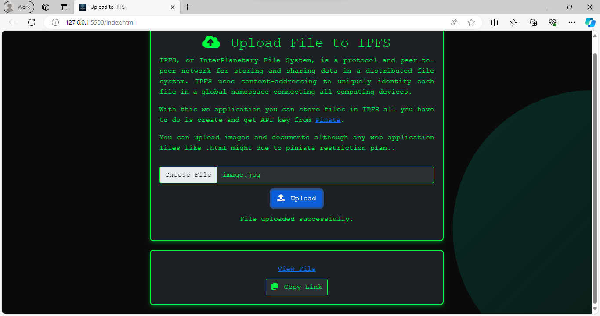

# IPFS Uploader

This web application enables users to upload files to the InterPlanetary File System (IPFS) through Pinata's cloud service. It uses a Node.js and Express backend with a straightforward HTML/CSS/JavaScript frontend for a seamless file uploading experience.



## What is IPFS?

The InterPlanetary File System (IPFS) is a protocol and peer-to-peer network designed to create a content-addressable, distributed file system. This innovative approach aims to connect all computing devices with the same system of files. In contrast to traditional URL-based addressing (where files are located by their location), IPFS addresses content based on its hash.

When a file is added to IPFS, it is split into smaller chunks, hashed, and given a unique fingerprint called a Content Identifier (CID). IPFS eliminates duplications across the network, tracks version history for every file, and manages files in a distributed way. This decentralized approach to file storage and sharing can help make the web faster, safer, and more open.

## Getting Started

### Prerequisites

- Ensure Node.js is installed on your system.
- A modern code editor, such as Visual Studio Code, with the Live Server extension (or similar) for running the frontend.

### Running the Server

1. **Clone the Repository**

   Clone this repository to your local machine using:

   ```
   git clone <repository-url>
   ```

2. **Install Dependencies**

   Navigate to the project directory in your terminal and install the required dependencies with:

   ```bash
   npm install
   ```

3. **Environment Variables**

   Create a `.env` file in the root of your project directory to store your Pinata API keys:

   ```
   PINATA_JWT=<yourPinataApiKey>
   ```

### Setting Up Pinata API Keys

1. **Create Pinata Account**

   Sign up or log in to [Pinata](https://www.pinata.cloud/).

2. **Generate API Keys**

   Navigate to the API Keys section in your Pinata dashboard and create a new API key. Make sure to record both the API Key.

3. **Configure `.env` File**

   Add your API keys to the `.env` file as shown above.

### Running the Application

1. **Start the Server**

   Launch the server with:

   ```bash
   node server.js
   ```

2. **Access the Frontend**

   Open `index.html` in your browser or use the Live Server extension in Visual Studio Code. Interact with the app through the frontend to upload files to IPFS.
---